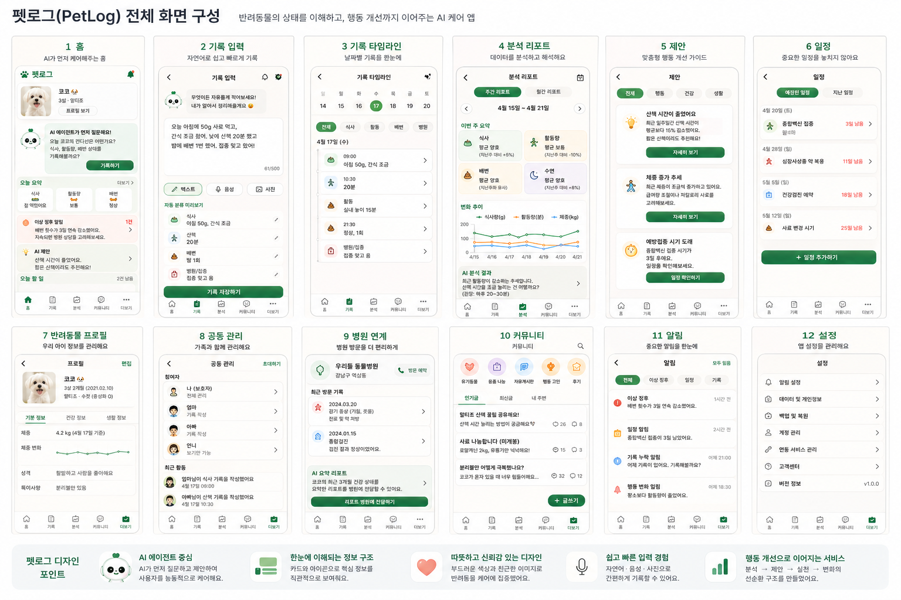
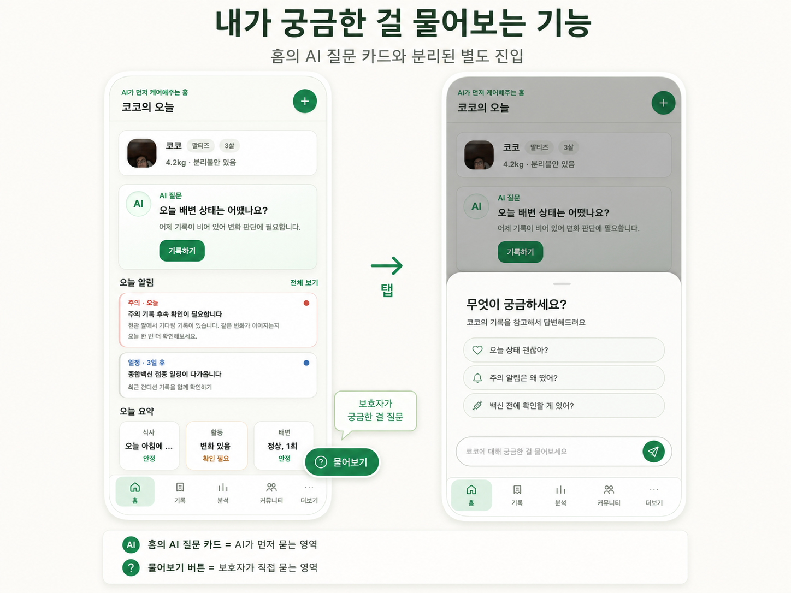

# Pet Log 포트폴리오 정리

## 1. 프로젝트 개요

**Pet Log**는 반려동물의 행동과 건강 기록을 단순히 저장하는 데서 끝내지 않고, 누적된 기록을 AI Agent가 해석해 상태 변화, 기록 누락, 위험 신호, 다음 행동 제안까지 연결하는 반려동물 관리 서비스입니다.

기존 반려동물 관리 앱은 예방접종, 진료, 사료량 등을 캘린더나 기록 형태로 저장하는 데 집중하는 경우가 많습니다. Pet Log는 보호자가 남긴 자연어, 음성, 사진 기반 기록을 구조화하고, 반려동물 프로필과 최근 기록 맥락을 함께 분석해 보호자가 다음 행동을 판단할 수 있도록 돕는 것을 목표로 했습니다.

| 항목 | 내용 |
| --- | --- |
| 프로젝트명 | Pet Log |
| 주제 | AI Agent 기반 반려동물 건강/행동 기록 관리 서비스 |
| 개발 기간 | 2026.04.22 ~ 2026.05.18 |
| 팀 구성 | 강현준, 김경표, 복만수, 임경빈 |
| 주요 형태 | 모바일 우선 웹 MVP + Python AI Agent 백엔드 |
| 핵심 가치 | 기록 부담 완화, 누적 맥락 분석, 행동 제안, 알림, 대화형 케어 경험 |

## 2. 문제 정의

반려동물 보호자는 매일의 식사, 배변, 산책, 행동, 병원 방문, 약 복용 같은 정보를 꾸준히 관리해야 하지만, 실제로는 기록이 누락되거나 중단되기 쉽습니다. 또한 기록이 쌓이더라도 단순 목록으로 남으면 보호자가 직접 패턴을 해석해야 하므로 데이터가 충분히 활용되지 못합니다.

이 프로젝트는 다음 문제를 해결 대상으로 삼았습니다.

- 보호자가 매번 정해진 양식에 맞춰 입력해야 하는 기록 부담
- 기록이 누락되거나 중단되면서 누적 데이터가 불완전해지는 문제
- 단일 기록만으로는 알기 어려운 반복 행동, 상태 변화, 위험 신호 해석의 어려움
- 기록 저장 이후 실제 행동 가이드, 일정 리마인더, 병원 상담 판단으로 이어지지 않는 한계
- 보호자가 앱에 지속적으로 재방문할 만한 감성적 동기 부족

## 3. 해결 방향

Pet Log는 기록 앱이 아니라 **기록을 해석하고 다음 행동으로 연결하는 AI 케어 Agent**를 지향했습니다.

핵심 방향은 다음과 같습니다.

- 자연어, 음성, 사진 기반 입력을 받아 보호자의 기록 부담을 낮춘다.
- 자유 입력을 카테고리, 제목, 상세 내용, 측정값, 신뢰도, 확인 필요 여부로 구조화한다.
- 반려동물 프로필, 최근 기록, 일정, 알림 후보를 함께 조립해 맥락 기반 분석을 수행한다.
- 누락 기록, 위험 신호, 행동 변화, 일정 기반 리마인더를 알림으로 제공한다.
- 건강 판단이 필요한 상황에서는 진단을 단정하지 않고 병원 상담을 권장하는 안전 경계를 유지한다.
- 반려동물 페르소나 기반 대화 경험으로 기록 관리의 피로도를 낮춘다.

## 4. 주요 기능

### 4.1 기록 입력 및 구조화

- 보호자가 입력한 자연어 기록을 AI가 식사, 산책/활동, 배변/소변, 병원/약/접종, 행동 등으로 분류합니다.
- 기록 입력은 미리보기와 저장 흐름으로 나뉘며, 사용자가 구조화 결과를 확인한 뒤 저장할 수 있습니다.
- 음성 파일은 Whisper 기반 STT로 텍스트화하고, AI가 `corrected_text`로 문장을 정리합니다.
- 사진 기반 기록 이해는 확장 가능한 provider 구조로 설계했습니다.

### 4.2 분석 및 제안

- 최근 기록을 기준으로 식사, 행동, 체중, 활동량 변화와 반복 패턴을 분석합니다.
- 통증, 호흡 이상, 혈변, 반복 구토, 지속적인 식욕 저하 같은 위험 신호를 탐지합니다.
- 분석 결과를 바탕으로 행동 개선 가이드와 건강 관리 제안을 생성합니다.
- 질병 확정 진단이나 처방이 아니라, 보호자가 다음 행동을 판단하도록 돕는 안내에 집중했습니다.

### 4.3 알림 및 일정

- `missing_record`, `risk`, `behavior_change`, `schedule` 4가지 유형의 알림 후보를 생성합니다.
- 알림은 중복 제거 키를 기준으로 관리하고, DB 기반 읽음 처리를 지원합니다.
- 예방접종, 약 복용, 건강검진, 사료 변경 시기 같은 케어 일정을 기반으로 리마인더를 제공합니다.

### 4.4 펫 대화 및 케어 질문

- 반려동물 이름, 사진, 성격, 최근 기록을 반영한 펫 페르소나 응답 구조를 설계했습니다.
- 보호자가 현재 키우는 반려동물과 대화하는 듯한 감성 인터페이스를 제공합니다.
- 케어 판단이 필요한 질문은 AI 케어 질문 흐름으로 연결하고, 위험 신호가 있는 경우 병원 상담을 권장합니다.

### 4.5 외부 서비스 연동

- Google Places API 기반 위치별 동물병원 추천을 제공합니다.
- 응급, 야간, 24시간, 호흡, 출혈, 경련, 중독 같은 표현을 반영해 병원 검색 반경과 검색어를 조정합니다.
- Naver Shopping API와 LLM을 결합해 반려동물 케어 맥락에 맞는 상품 추천 이유를 생성합니다.

### 4.6 커뮤니티 및 확장 기능

- 유기동물, 용품 나눔, 자유게시판, 행동 고민, 후기 게시판 구조를 제공합니다.
- 커뮤니티 글, 댓글, 반응 API를 기본 구현했습니다.
- 공동 관리, 병원 리포트, RAG 기반 케어 지식, 커머스 개인화로 확장 가능한 구조를 마련했습니다.

## 5. 구현 화면

구현된 주요 웹 페이지는 다음과 같습니다.

| 경로 | 화면 |
| --- | --- |
| `/` | 홈 |
| `/record` | 기록 입력 |
| `/analysis` | 분석 |
| `/timeline` | 기록 타임라인 |
| `/suggestions` | AI 제안 |
| `/profile` | 반려동물 프로필 |
| `/notifications` | 알림 |
| `/schedule` | 일정 |
| `/community` | 커뮤니티 |
| `/hospital` | 병원 연계 |
| `/shopping` | 쇼핑 |
| `/shared-care` | 공동 관리 |
| `/settings` | 설정 |

### UI 참고 이미지





## 6. 기술 스택

### 6.1 Frontend

| 영역 | 기술 | 역할 |
| --- | --- | --- |
| Framework | Next.js `^16.2.4` | App Router, Route Handler, standalone build |
| UI | React `^19.2.5` | 페이지 및 공통 컴포넌트 구성 |
| Language | TypeScript | 타입 안정성 확보 |
| Styling | Tailwind CSS, global CSS | 모바일 우선 UI 스타일링 |
| HTTP | Axios | API 호출 및 FastAPI 프록시 연동 |
| Test | `tsx --test` | 프론트엔드 단위 테스트 |
| E2E/QA | Playwright | 모바일 UI, 주요 플로우, 시각 QA |
| Deploy | Azure App Service | Node.js 런타임 기반 배포 |

### 6.2 Backend

| 영역 | 기술 | 역할 |
| --- | --- | --- |
| Language | Python `>=3.12` | AI Agent 백엔드 구현 |
| API | FastAPI `>=0.136.1` | HTTP API, health check, 기록 입력, STT, 추천 API |
| Server | Uvicorn | ASGI 서버 실행 |
| Agent Graph | LangGraph `>=1.1,<2.0` | Pet Log agent pipeline과 쇼핑 추천 workflow orchestration |
| LLM Adapter | LangChain `>=1.0,<2.0` | 모델, tool, middleware adapter |
| Storage | SQLite | 로컬 영구 저장소 |
| Speech | OpenAI Whisper, edge-tts | STT/TTS provider |
| Search/RAG | ChromaDB, Tavily, pypdf | 케어 지식 검색 확장 기반 |
| Test/Lint | unittest, pytest, Ruff | 백엔드 검증 및 정적 분석 |
| Package | uv, pyproject.toml | 의존성 및 실행 환경 관리 |

## 7. 시스템 아키텍처

프로젝트는 프론트엔드와 백엔드를 분리하고, 백엔드는 계층형 구조로 외부 SDK와 비즈니스 로직의 결합을 낮추도록 설계했습니다.

```text
Browser
  -> Next.js App Router pages
  -> Next.js Route Handler /api/v1/...
  -> FastAPI backend /api/v1/...
  -> application pipeline
  -> application agents
  -> repositories, policies, LLM providers, speech providers, external APIs
```

백엔드 내부 구조는 다음 흐름을 따릅니다.

```text
presentation
  -> application pipelines
  -> application agents
  -> interfaces
  -> infrastructure / tools / agent_runtime
```

각 계층의 책임은 다음과 같습니다.

- `domain`: 순수 도메인 타입. DB, HTTP, LLM SDK에 직접 의존하지 않습니다.
- `application`: 제품 흐름과 interface 계약을 정의합니다.
- `infrastructure`: DB, LLM, STT/TTS, rule-based policy, 외부 API 구현체를 둡니다.
- `agent_runtime`: LLM agent 실행 loop, prompt, tool registry, memory를 담당합니다.
- `middleware`: safety, logging, tracing, retry, validation 같은 공통 처리를 담당합니다.
- `tools`: agent가 호출할 수 있는 record, profile, schedule, care, speech tool을 제공합니다.
- `presentation`: FastAPI HTTP와 CLI 같은 외부 진입점을 담당합니다.

LangGraph는 모든 에이전트에 무조건 적용하지 않고, 상태 전이가 분명한 흐름에 선택적으로 사용했습니다. 자연어 기록 입력 파이프라인은 `structure_record -> load_context -> analyze_context -> detect_risk -> save_records -> suggest_care -> recommend_shopping -> plan_reminders` 순서의 `StateGraph`로 구성했고, 쇼핑 추천 에이전트는 내부적으로 `prepare_categories -> search_products -> select_recommendations -> build_result` 노드로 나누어 실행합니다. 반면 병원 추천은 응급 여부 판단, 반경 조정, Google Places 검색, 정렬/필터링 흐름이 비교적 짧기 때문에 LangGraph보다 일반 application agent와 provider/middleware 조합으로 단순하게 유지했습니다.

## 8. AI Agent 설계

### 8.1 기록 분석 Agent Track

| Agent | 역할 |
| --- | --- |
| RecordStructuringAgent | 자유 텍스트를 구조화된 기록 후보로 변환 |
| ContextAnalysisAgent | 최근 기록 패턴, 누락 기록, 상태 변화, UI 이동 경로 분석 |
| RiskDetectionAgent | 건강/안전 위험 신호 탐지 |
| SuggestionAgent | 행동 개선 가이드와 건강 관리 제안 생성 |
| ReminderAgent | 접종, 약 복용, 사료 변경, 건강검진 리마인더 계획 |
| NotificationAgent | 알림 후보 생성, 중복 제거, 읽음 처리 흐름 연결 |

### 8.2 대화, 검색, 외부 연동 Track

| Agent 또는 Provider | 역할 |
| --- | --- |
| PetPersonaAgent | 반려동물 프로필과 최근 기록을 반영한 대화 응답 |
| CareAnswerProvider | 케어 질문에 반려동물 맥락과 케어 지식 검색 결과를 결합 |
| ShoppingAgent | LangGraph 기반으로 쇼핑 카테고리 생성, Naver Shopping 후보 검색, LLM 상품 선택, 추천 이유 생성을 오케스트레이션 |
| HospitalRecommendationAgent | 응급/야간 문맥을 반영해 Google Places 기반 위치별 동물병원 추천 |
| PhotoRecordUnderstandingAgent | 이미지 기반 기록 이해 확장 지점 |

쇼핑 추천은 LLM 판단과 외부 검색 API가 여러 단계로 이어지기 때문에 LangGraph로 각 단계를 노드화했습니다. 카테고리 생성에 실패하면 빈 추천으로 종료하고, 상품 선택 LLM이 실패하면 첫 번째 후보를 유지하는 식으로 fallback 경계를 명확히 했습니다. 병원 추천은 같은 외부 연동 기능이지만 의료 안전 문맥이 더 중요하므로, 검색 반경 확대와 24시간 병원 우선 정렬은 명시적 규칙으로 두고 provider 실패 시 Google Maps 검색 링크 fallback을 제공했습니다.

## 9. 주요 API 구현

백엔드는 FastAPI 기반으로 다음 API를 구현했습니다.

- `GET /api/v1/me`: 현재 사용자 정보 조회
- `GET /api/v1/pets`: 반려동물 목록 조회
- `GET /api/v1/pet-log/records`: 특정 반려동물의 최근 기록 조회
- `POST /api/v1/pet-log/records`: 자연어 기록 입력 pipeline 실행
- `GET /api/v1/pet-log/schedules`: 일정 목록 조회
- `POST /api/v1/files`: 이미지 업로드
- `GET /api/v1/files/{file_id}`: 업로드 이미지 다운로드
- `POST /api/v1/speech/transcriptions`: 음성 파일 STT 변환
- `POST /api/v1/speech/text-corrections`: 변환된 음성 문장 보정
- `GET /api/v1/notifications`: 실시간 알림 후보 생성 및 DB 조회
- `PATCH /api/v1/notifications/{id}/read`: 알림 읽음 처리
- `PUT /api/v1/notifications/read`: 읽음 알림 목록 저장
- `POST /api/v1/hospitals/recommendations`: 위치 기반 동물병원 추천
- `GET /api/v1/shopping/recommendations`: Naver Shopping + LLM 기반 상품 추천
- `GET /api/v1/community/boards`: 커뮤니티 게시판 및 피드 조회
- `GET /api/v1/community/posts`: 커뮤니티 글 목록 조회
- `POST /api/v1/community/posts`: 커뮤니티 글 작성
- `POST /api/v1/community/posts/{post_id}/comments`: 댓글 작성
- `POST /api/v1/community/posts/{post_id}/reactions`: 글 반응 처리

## 10. 검증 및 품질 관리

프론트엔드 검증 명령은 다음과 같습니다.

```bash
cd frontend/app/web
npm test
npm run lint
npm run typecheck
npm run build
npm run test:e2e
npm run eval
```

백엔드 검증 명령은 다음과 같습니다.

```bash
cd backend
uv run python -B -m unittest discover -s tests -v
uv run python -B -c "import application, agent_runtime, middleware, tools, infrastructure, presentation, composition; print('target imports ok')"
rg -n "fastapi|openai|sqlalchemy|sqlite|postgres|psycopg" src/application src/domain
```

마지막 명령은 `application`과 `domain` 계층이 외부 framework나 SDK에 직접 의존하지 않는지 확인하기 위한 경계 검증입니다. 기대 결과는 출력이 없는 상태입니다.

## 11. 배포 준비

프론트엔드는 Next.js App Router와 API route를 사용하므로 정적 호스팅이 아니라 Node.js 런타임이 있는 Azure App Service 배포를 기준으로 구성했습니다.

```bash
cd frontend/app/web
npm run azure:package
npm run azure:deploy -- pet-log-rg pet-log-kp-20260504 "Azure for Students"
```

백엔드는 FastAPI 기반 Azure App Service 배포 스크립트를 제공합니다.

```bash
cd backend
bash scripts/azure-package.sh
bash scripts/azure-deploy.sh <resource-group> <app-name> [subscription]
```

## 12. 프로젝트 성과

### 12.1 기능 구현 성과

- 모바일 우선 Next.js 웹 MVP를 구현했습니다.
- 홈, 기록, 분석, 타임라인, 알림, 일정, 프로필, 커뮤니티, 병원, 쇼핑 등 주요 화면을 구성했습니다.
- 자연어 기록 입력을 구조화하고, 분석 후 DB에 저장하는 backend pipeline을 연결했습니다.
- FastAPI와 SQLite 기반으로 기록, 일정, 알림, 파일, 음성, 병원 추천, 커뮤니티, 쇼핑 추천 API를 구현했습니다.
- 알림 후보 생성, 중복 제거, 읽음 처리까지 포함한 알림 파이프라인을 구현했습니다.
- Naver Shopping API와 LLM을 결합한 쇼핑 추천 흐름을 LangGraph 기반 에이전트로 구현했습니다.
- Google Places API 기반 동물병원 추천과 fallback 처리를 구현했습니다.
- 프론트엔드 단위 테스트, Playwright QA, 백엔드 unittest 검증 체계를 정리했습니다.
- Azure App Service 배포 스크립트와 운영 문서를 마련했습니다.

### 12.2 설계 성과

- 단순 기록 앱이 아니라 기록, 분석, 제안, 알림, 대화로 이어지는 agent 제품 흐름을 설계했습니다.
- `presentation -> application -> infrastructure` 계층 구조로 HTTP, DB, LLM SDK 의존성을 분리했습니다.
- LangGraph를 기록 분석 파이프라인과 쇼핑 추천 에이전트에 적용해 단계별 상태 업데이트를 테스트하고 관찰할 수 있게 했습니다.
- LLM provider를 기능별로 분리해 기록 구조화, 기록 요약, 케어 답변, 펫 페르소나, 이미지 기록 이해로 확장할 수 있게 했습니다.
- Gemma(Ollama)와 GPT를 primary/fallback으로 전환할 수 있는 하이브리드 LLM 구조를 지원했습니다.
- RAG, 이미지 기록 이해, 병원 제출용 리포트, 커머스 개인화로 확장 가능한 경계를 마련했습니다.

## 13. 회고

### 데이터 정규화가 AI 기능의 기반이었다

자연어, 음성, 사진처럼 입력 형태가 다양해질수록 동일한 기록 계약으로 정규화하는 과정이 중요했습니다. 기록 구조가 안정되어야 분석, 알림, 제안, 타임라인 조회가 같은 데이터를 기준으로 연결될 수 있었습니다.

### 건강 도메인에서는 안전 경계가 중요했다

반려동물 건강 맥락에서는 AI가 편리한 답변을 제공하는 것보다 진단성 표현을 피하고, 위험 신호가 있을 때 병원 상담을 권장하는 것이 중요했습니다. 그래서 위험 감지와 제안 문구는 행동 판단을 돕되 의료적 결정을 대체하지 않도록 설계했습니다.

### 누적 맥락이 제품 차별점이 되었다

단발성 질문에 답하는 AI보다 최근 기록, 일정, 프로필, 반복 패턴을 함께 보는 AI가 보호자에게 더 실질적인 도움을 줄 수 있었습니다. Pet Log의 핵심 차별점은 데이터를 저장하는 것이 아니라 누적 맥락을 해석해 다음 행동으로 연결하는 데 있습니다.

### LangGraph는 복잡한 흐름에 선택적으로 적용해야 했다

처음에는 병원 추천과 쇼핑 추천을 모두 같은 방식의 에이전트로 설명하고 싶었지만, 실제 구현을 진행하면서 두 기능의 복잡도가 다르다는 점이 드러났습니다. 쇼핑 추천은 LLM으로 검색 카테고리를 만들고, 외부 API 결과를 받은 뒤, 다시 LLM으로 Top 3 후보 중 하나를 고르고 추천 이유를 붙이는 다단계 흐름이었습니다. 그래서 LangGraph로 노드를 나누는 편이 테스트와 설명 모두에 유리했습니다.

반대로 병원 추천은 응급 키워드, 야간 시간대, 검색 반경, 24시간 운영 여부처럼 규칙 기반 판단이 핵심이었습니다. 이 흐름까지 그래프로 감싸면 포트폴리오상 기술 사용은 더 화려해 보일 수 있지만, 실제 코드에서는 provider와 middleware 조합이 더 단순하고 명확했습니다. 이 시행착오를 통해 기술을 많이 쓰는 것보다, 문제의 단계 수와 실패 지점에 맞게 적용 범위를 정하는 것이 더 중요하다는 점을 확인했습니다.

### 외부 API 에이전트는 실패 경로 설계가 핵심이었다

쇼핑 추천에서는 Naver API 결과가 비어 있거나 LLM 선택이 실패하는 경우를 고려해야 했고, 병원 추천에서는 Google Places API key 누락, rate limit, 검색 실패 상황에서도 보호자에게 최소한의 다음 행동을 안내해야 했습니다. 그래서 두 에이전트 모두 성공 흐름보다 fallback 흐름을 먼저 안정화하는 데 시간이 들었습니다. 결과적으로 쇼핑은 규칙 기반 네이버 검색 fallback, 병원은 Google Maps 검색 링크 fallback과 캐시/rate limit middleware를 두어 외부 API 의존으로 서비스 경험이 끊기지 않도록 설계했습니다.

### 확장 가능한 계층 구조가 후속 기능의 여지를 만들었다

초기 MVP 범위 안에서도 병원 추천, 쇼핑 추천, 음성 입력, RAG, 이미지 이해 같은 기능이 함께 고려되었습니다. 계층과 provider 경계를 분리해 둔 덕분에 후속 기능을 추가할 때 기존 제품 흐름을 크게 흔들지 않고 확장할 수 있는 기반을 확보했습니다.

## 14. 향후 개선 방향

- 승인된 케어 지식 URL을 수집하고, chunking, embedding, similarity search, citation prompt를 포함한 RAG 답변을 고도화합니다.
- 사진 기반 사료량, 배변 상태, 자세, 행동 기록 이해 기능을 강화합니다.
- 누적 기록과 증상 요약을 병원 제출용 리포트로 정리하고 예약/상담 흐름과 연결합니다.
- 건강 상태와 기록 맥락을 기반으로 사료, 용품, 보험, 제휴 상품 추천을 정교화합니다.
- 가족/보호자 초대, 역할 설정, 산책·다이어트·문제행동 개선 미션 같은 공동 관리 기능을 확장합니다.
