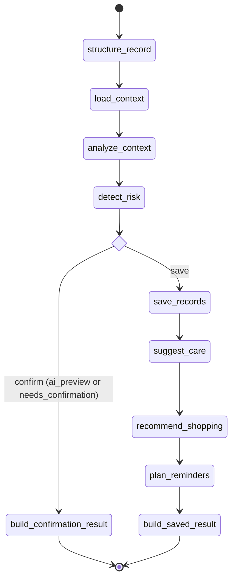

# End-to-end Agent Flow

## 목적

이 문서는 `기획.md`의 전체 흐름을 한 번에 보기 위한 기준 문서다. 세부 class나 파일 설명보다, 사용자의 기록이 어떤 agent와 provider를 거쳐 홈, 분석 리포트, 병원 요약, 알림, 펫 대화로 이어지는지에 집중한다.

핵심 제품 방향:

```text
기록
  -> 해석
  -> 요약
  -> 행동 제안
  -> 재방문/관리 행동
```

## 전체 흐름

```text
사용자 입력
  - 텍스트
  - 음성
  - 사진
  - 빠른 입력

  -> 입력 이해
     - SpeechToTextProvider
     - RecordStructuringAgent
     - PhotoRecordUnderstandingAgent

  -> 기록 후보 생성
     - StructuredRecordBatch
     - StructuredRecordCandidate tuple
     - 보호자 확인 필요 여부 판단

  -> 기록 저장
     - RecordRepository
     - PetRecord tuple

  -> 누적 맥락 분석
     - ContextAnalysisAgent
     - PatternAnalyzer
     - MissingRecordPolicy
     - CauseHypothesisPolicy 후보
     - ContextAnalysisResult

  -> 위험 신호 감지
     - RiskDetectionAgent
     - RiskSignalPolicy
     - SafetyNotice

  -> 모델 기반 요약
     - RecordSummaryAgent
     - RecordSummaryProvider 후보
     - RecordSummaryResult

  -> 행동 제안/관리 후보
     - SuggestionAgent
     - ReminderAgent
     - ProactiveQuestionAgent
     - NotificationAgent

  -> 사용자 노출
     - 홈
     - 분석 리포트
     - 병원 제출용 요약
     - 알림
     - AI 케어 질문
     - 펫 대화
```

## 역할 경계

| 역할 | 책임 | 예시 |
| --- | --- | --- |
| Agent | 언제 무엇을 처리할지 결정하고 흐름을 조립한다. | `RecordSummaryAgent`, `ContextAnalysisAgent` |
| Provider | 모델, STT, TTS, vision 같은 외부/모델 호출을 숨긴다. | `RecordSummaryProvider`, `RecordStructurer` |
| Policy | 규칙 기반 판단을 담당한다. | `MissingRecordPolicy`, `RiskSignalPolicy` |
| Composer | 화면/리포트용 결과를 조립하거나 fallback 문장을 만든다. | `HomeFeedComposer`, `RecordSummaryComposer` |
| Repository | 저장/조회 책임을 담당한다. | `RecordRepository`, `PetProfileRepository` |
| Pipeline | 제품 surface 또는 use case의 실행 경계를 담당한다. | `PetLogAgentPipeline`, `HomeFeedPipeline` |

## 핵심 use case 흐름

### 1. 기록 입력

```text
PetLogAgentInput
  -> RecordStructuringAgent
  -> RecordStructurer
  -> StructuredRecordBatch
```

음성 입력은 먼저 `SpeechToTextProvider`를 거쳐 텍스트가 되고, 사진 입력은 `PhotoRecordUnderstandingAgent`와 `ImageRecordUnderstandingProvider`를 통해 구조화 후보가 된다.

보호자 확인이 필요한 경우 바로 저장하지 않고 수정/확인 단계로 돌린다.

문장 하나에 여러 사건이 섞이면 `StructuredRecordBatch.candidates`에 여러 `StructuredRecordCandidate`를 담는다. 예를 들어 식사와 산책 상태가 함께 들어온 문장은 식사 후보와 산책 후보로 분리하고, 확인이 완료되면 각각 저장한다.

### 2. 기록 저장 후 core agent 실행

```text
StructuredRecordBatch
  -> RecordRepository
  -> PetRecord tuple
  -> ContextAnalysisAgent
  -> RiskDetectionAgent
  -> SuggestionAgent
  -> ShoppingAgent
  -> ReminderAgent
  -> PetLogAgentResult
```

`PetLogAgentPipeline`은 기록 입력 후의 core orchestration owner다. 현재 LangGraph를 통해 각 단계를 노드로 관리하며, 제품의 비즈니스 로직 흐름에 따라 순차적/조건부로 실행된다.

### 3. 누적 기록 분석

```text
PetProfile + recent PetRecord tuple + due schedules
  -> ContextAnalysisAgent
  -> ContextAnalysisResult
```

분석 책임은 다음으로 나뉜다.

- 패턴 분석: 식사, 배변, 산책, 행동 변화 추이
- 누락 감지: 일정 기간 기록이 없는 항목
- 위험 맥락: 병원 상담이 필요한 이상 신호
- 원인 추정 후보: 진단이 아니라 가능한 맥락, 확인 질문, 관찰 포인트

### 4. 모델 기반 요약

```text
PetProfile
  + PetRecord tuple
  + ContextAnalysisResult
  + PlannedReminder tuple
  -> RecordSummaryAgent
  -> RecordSummaryProvider
  -> RecordSummaryResult
```

요약은 사람이 읽는 자연어 결과이므로 모델 provider가 필요하다. `RecordSummaryAgent`가 직접 GPT, LangChain, LangGraph 타입을 import하지 않는다. 실제 모델 호출은 `RecordSummaryProvider` 구현체가 담당한다.

현재 구현 기준으로 `RecordSummaryProvider`는 LangChain `ChatOpenAI.with_structured_output()`을 사용한다. 실행에는 `OPENAI_API_KEY`가 필요하고, 기본 모델은 `gpt-5-mini`다. 모델은 `OPENAI_RECORD_SUMMARY_MODEL` 환경변수로 바꿀 수 있다.

모델 요약 구현은 `record_summary/` 하위의 `provider.py`, `model.py`, `schema.py`, `prompt.py`, `mapper.py`로 나뉜다. 팀원이 직접 수정할 때는 provider 한 파일에 모든 책임을 넣지 않고, 모델 생성, 프롬프트, schema, 변환 로직을 각각의 파일에서 채운다.

`RecordSummaryComposer`는 다음 용도로 제한한다.

- 모델이 없는 테스트/fallback 요약
- 모델 응답을 `RecordSummaryResult`로 포맷팅
- 병원 제출용 문구로 재구성하기 전의 deterministic 보정

### 5. 행동 제안

```text
ContextAnalysisResult + SafetyNotice tuple
  -> SuggestionAgent
  -> CareSuggestion tuple
```

행동 제안은 진단이나 치료 지시가 아니다. 보호자가 할 수 있는 관찰, 기록, 생활 관리, 병원 상담 권장 수준으로 제한한다.

### 6. 홈 노출

```text
PetLogAgentResult
  + due schedules
  + RecordSummaryResult 후보
  + ProactiveQuestionResult 후보
  -> HomeFeedPipeline
  -> HomeFeedResult
```

홈은 오늘 요약, 최근 변화, 이상 징후, 제안 카드, 오늘 할 일, 기록 누락 알림, 빠른 기록, 펫 대화 진입점을 보여준다.

홈의 `AI가 먼저 질문하는 한줄 구간`은 `ProactiveQuestionAgent`가 담당한다. 홈 composer는 화면에 맞게 조립만 한다.

### 7. 분석 리포트

```text
PetRecord tuple
  + ContextAnalysisResult
  + RecordSummaryResult
  -> 분석 리포트 surface
```

분석 리포트는 식사 패턴, 행동 패턴, 활동량 변화, 이상 징후 기록, 주간/월간 요약을 보여준다. 모델 요약은 이 surface의 설명 문장으로 재사용된다.

### 8. 병원 제출용 요약

```text
PetRecord tuple
  + ContextAnalysisResult
  + RecordSummaryResult
  -> HospitalSummaryPipeline
  -> HospitalSummaryResult
```

병원 제출용 요약은 진료 예약/공유 전송과 다르다. 이 pipeline은 증상 요약, 변화 기록 정리, 위험 신호 정리까지만 담당한다. 병원 검색, 예약, 공유 링크, 실제 전송은 별도 hospital integration bounded context로 분리한다.

### 9. 알림

```text
ContextAnalysisResult
  + SafetyNotice tuple
  + PlannedReminder tuple
  -> NotificationAgent
  -> NotificationCandidate tuple
```

알림 후보 생성과 실제 push/email 전송은 분리한다. 같은 원인으로 반복 발송되지 않도록 `dedupe_key`를 둔다.

### 10. AI 케어 질문과 펫 대화

```text
CareContext
  -> CareQuestionPipeline
  -> CareAnswerProvider
  -> CareQuestionResult
```

```text
CareContext
  -> PetChatPipeline
  -> PetPersonaResponder
  -> PetChatResult
```

AI 케어 질문은 기록 기반 케어 조언을 담당한다. 펫 대화는 감성/일상 대화를 담당한다. 건강 판단이 필요한 질문은 펫 대화에서 직접 답하지 않고 케어 질문 또는 병원 상담 안내로 연결한다.

## LangGraph 구조 (Mermaid)



## LangGraph 연결 원칙

LangGraph는 infrastructure class를 전부 등록하는 곳이 아니다. 의미 있는 use case 단위만 node로 감싼다.

실제 구현 노드 (`LangGraphPetLogAgentPipeline` 기준):

- `structure_record`: 자연어 입력을 구조화 후보로 변환
- `load_context`: 최근 기록 및 예정 일정 로드
- `analyze_context`: 맥락 및 패턴 분석
- `detect_risk`: 위험 신호 감지
- `build_confirmation_result`: (미리보기/확인 필요 시) 확인 결과 빌드 및 종료
- `save_records`: 기록 실제 저장
- `suggest_care`: 케어 제안 생성
- `recommend_shopping`: 관련 용품 추천
- `plan_reminders`: 향후 일정/리마인더 계획
- `build_saved_result`: 최종 저장 결과 빌드

조건부 라우팅 (`_route_after_risk_detection`):
- `ai_preview` 소스이거나, 구조화 결과가 확인을 필요로 하는데 `confirm` 플래그가 없는 경우 `confirm` 경로를 탄다.
- 그 외의 경우 `save` 경로를 통해 실제 저장 및 후속 분석/제안 단계를 실행한다.

직접 node로 등록하지 않는 것:

- repository 구현체
- provider 구현체
- composer 구현체
- policy 구현체
- LLM SDK client

예:

```text
LangGraph node: suggest_care
  -> SuggestionAgent.suggest()
     -> CareSuggestion tuple
```

## 현재 결정

- 제품의 중심 흐름은 `기록 -> 해석 -> 요약 -> 행동 제안 -> 쇼핑 추천`이다.
- `ContextAnalysisAgent`는 분석까지 담당한다.
- `RecordSummaryAgent`는 분석 결과와 원본 기록을 모델 provider에 넘겨 요약 결과를 만든다.
- 자연어 요약은 `RecordSummaryProvider` 후보가 담당해야 한다.
- `RecordSummaryComposer`는 모델 없는 fallback 또는 포맷팅 용도로 제한한다.
- LangGraph는 agent/use case 단위 orchestration에만 사용하고, provider/policy/composer를 직접 graph node로 노출하지 않는다.
- 의료 판단은 하지 않고, 위험 신호는 `SafetyNotice`와 병원 상담 안내로 제한한다.
