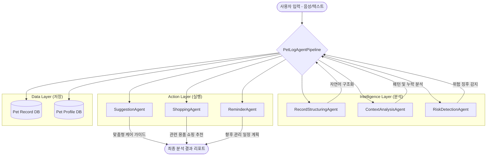
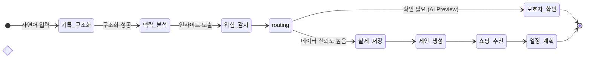

# PetLog Agent System Architecture

이 문서는 펫로그 서비스의 에이전트 시스템 구조를 시각화하거나 인포그래픽으로 제작하기 위한 핵심 가이드를 담고 있습니다.

---

## 1. 하이레벨 아키텍처 (High-Level Architecture)

---

## 2. 에이전트별 상세 역할 (Agent Role Cards)

| 아이콘 | 에이전트명 | 핵심 역할 | 결과물 (Output) |
| :--- | :--- | :--- | :--- |
| 📝 | **Record Structuring** | 자연어 문장에서 기록 요소 추출 | 정형화된 기록 객체 (배치) |
| 🔍 | **Context Analysis** | 최근 14일 기록 기반 패턴 분석 | 관리 통찰 (Insights) |
| ⚠️ | **Risk Detection** | 이상 징후 및 건강 위험 감지 | 안전 고지 (Safety Notices) |
| 💡 | **Care Suggestion** | 분석 결과에 따른 케어 가이드 | 맞춤 행동 제안 (Suggestions) |
| 🛒 | **Shopping Recommendation** | 케어에 필요한 용품 매칭 | 쇼핑 추천 목록 |
| 🔔 | **Reminder Planning** | 예방접종 및 정기 검진 일정 생성 | 향후 관리 리마인더 |

---

## 3. LangGraph 워크플로우 (Operational Flow)

에이전트들이 협력하는 **비즈니스 로직 시퀀스**입니다.

---

## 4. 인포그래픽 디자인 가이드

### 🎨 컬러 전략
- **데이터 구조화 (Blue)**: `#3498db` - 신뢰성과 정밀함
- **맥락 분석 (Indigo)**: `#34495e` - 깊이 있는 통찰
- **위험 감지 (Red)**: `#e74c3c` - 긴급성 및 주의
- **추천 및 제안 (Green)**: `#2ecc71` - 건강과 긍정적 액션

### 🖼️ 시각적 요소
- **입력 섹션**: 마이크(음성) + 키보드(텍스트) 아이콘
- **중앙 파이프라인**: LangGraph의 유기적인 연결을 보여주는 노드와 간선
- **출력 섹션**: '리포트 카드', '장바구니', '캘린더' 아이콘을 활용한 결과 시각화
